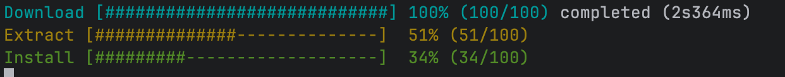

# ProgressBar-CPP
Allows for progress bars to be implemented in code.

## Features
- Multiple progress bars rendered in-place in a terminal (doesn’t spam new lines).
- Simple ID-based API: create, update (absolute or +1), mark complete.
- Color enum (ANSI colors) with `NO_COLOR` support.
- Throttled redraws to reduce stderr overhead.
- Optional per-task duration logging to a file.
- Optional auto-removal of completed bars.
- **Compile-time disable switch** (no call-site changes required).

## Requirements
- C++17
- CMake 3.20+

## Add to your project (FetchContent)
In your project’s `CMakeLists.txt`:

```cmake
include(FetchContent)

FetchContent_Declare(
  ProgressBar
  GIT_REPOSITORY https://github.com/nathanjrussell/ProgressBar-CPP.git
  GIT_TAG main
)
FetchContent_MakeAvailable(ProgressBar)

target_link_libraries(your_target PRIVATE ProgressBar::progressbar)
```

Then in your code:

```cpp
#include <progressbar/progress_bars.hpp>

progressbar::ProgressBars pbs;
int id = pbs.createProgressBar(100, "Work", progressbar::ProgressBars::Color::Green);
```

## Disabling progress bars (no call-site changes)
This library supports a **compile-time** enable/disable macro:

- `PROGRESSBAR_ENABLED=1` (default): `progressbar::ProgressBars` is the real implementation.
- `PROGRESSBAR_ENABLED=0`: `progressbar::ProgressBars` becomes a **no-op** type.

When disabled:
- The methods still exist at the call site (same names/signatures), but do nothing.
- The real implementation `.cpp` compiles out, so it won’t pull in terminal/ANSI dependencies.

### Option A: disable globally for your configure
If you configure *your whole build* with it off:

```bash
cmake -S . -B build -DPROGRESSBAR_ENABLED=OFF
```

### Option B: disable per target (recommended)
You can disable progress bars only for a specific executable/library target:

```cmake
target_link_libraries(your_target PRIVATE ProgressBar::progressbar)

# Force the compile-time no-op behavior for this target.
target_compile_definitions(your_target PRIVATE PROGRESSBAR_ENABLED=0)
```

Important: keep `PROGRESSBAR_ENABLED` consistent across translation units that include
`<progressbar/progress_bars.hpp>` in a given binary, so the type alias doesn’t differ.

## Build examples
```bash
cmake -S . -B build
cmake --build build
./build/examples/progressbar-example
```

Disable examples:
```bash
cmake -S . -B build -DPROGRESSBAR_BUILD_EXAMPLES=OFF
```

## Basic usage
```cpp
#include <chrono>
#include <cstdint>
#include <thread>

#include <progressbar/progress_bars.hpp>

int main() {
  using namespace std::chrono_literals;
  progressbar::ProgressBars::Options options;
  options.enabled = true;
  options.minRedrawInterval = std::chrono::milliseconds(40);
  options.barWidth = 28;
  options.removeCompletedAfter = std::chrono::milliseconds(2000);
  // Demonstrates optional logging of completed task durations.
  progressbar::ProgressBars pbs(options, std::string{"progressbar-example.log"});

  const std::uint64_t total = 100;
  const int a = pbs.createProgressBar(total, "Download", progressbar::ProgressBars::Color::Cyan);
  const int b = pbs.createProgressBar(total, "Extract", progressbar::ProgressBars::Color::Yellow);

  // Create using a stable string key. Returns the underlying int id.
  const int c = pbs.createProgressBar("install", total, "Install", progressbar::ProgressBars::Color::Green);

  for (std::uint64_t i = 0; i <= total; ++i) {
    pbs.updateProgressBar(a, i);
    if (i % 2 == 0) pbs.updateProgressBar(b);
    // Update using the string id.
    if (i % 3 == 0) pbs.updateProgressBar("install");
    std::this_thread::sleep_for(20ms);
  }
// Complete using a mix of int and string ids.
  pbs.markProgressBarComplete(a);

  std::this_thread::sleep_for(3000ms);

  pbs.markProgressBarComplete(b);

  // Let the completed bars auto-remove.
  std::this_thread::sleep_for(7500ms);
  pbs.markProgressBarComplete("install");
  return 0;
}
```
The above will creat the following output in the terminal:




## Notes on terminal support
Single-line `\r` can only rewrite one line. To support multiple live progress bars without filling the terminal,
this library uses a small set of widely-supported ANSI escape sequences:
- cursor up: `ESC[<N>A`
- clear to end of line: `ESC[K`
- delete line (reclaim space): `ESC[<N>M`
- colors: `ESC[...m`

Progress rendering is sent to **stderr**. If stderr isn’t a TTY (e.g., redirected output/CI logs), rendering is
automatically disabled by default.

## License
MIT License

Copyright (c) 2026

Permission is hereby granted, free of charge, to any person obtaining a copy
of this software and associated documentation files (the "Software"), to deal
in the Software without restriction, including without limitation the rights
to use, copy, modify, merge, publish, distribute, sublicense, and/or sell
copies of the Software, and to permit persons to whom the Software is
furnished to do so, subject to the following conditions:

The above copyright notice and this permission notice shall be included in all
copies or substantial portions of the Software.

THE SOFTWARE IS PROVIDED "AS IS", WITHOUT WARRANTY OF ANY KIND, EXPRESS OR
IMPLIED, INCLUDING BUT NOT LIMITED TO THE WARRANTIES OF MERCHANTABILITY,
FITNESS FOR A PARTICULAR PURPOSE AND NONINFRINGEMENT. IN NO EVENT SHALL THE
AUTHORS OR COPYRIGHT HOLDERS BE LIABLE FOR ANY CLAIM, DAMAGES OR OTHER
LIABILITY, WHETHER IN AN ACTION OF CONTRACT, TORT OR OTHERWISE, ARISING FROM,
OUT OF OR IN CONNECTION WITH THE SOFTWARE OR THE USE OR OTHER DEALINGS IN THE
SOFTWARE.
